# 02. Economy & game loop

## 1. Purpose
Owns the Night / Round / Quota structure, the gangster debt curve, the Stream income model, and the single `Shop` catalog every Cash sink hangs off.
Rewritten against 06 D4/D7 as amended by P2 (no roles, free-roam bar), P3 (Bartender NPC is the Shop) and P5 (income sheet below).

## 2. Concepts & data model

### `NightConfig` (`Resource`) — `src/gameplay/economy/night_config.gd`
| field | type | value / note |
|---|---|---|
| `night_number` | `int` | 1–5 campaign, 6+ endless |
| `quota` | `int` | Cash owed at Night end (§3.4) |
| `rounds_count` | `int` | `3` |
| `round_time_limit_sec` | `float` | `120.0 [tune]` — sized for ~10 shots at a 12 s cycle |
| `object_ball_count` | `int` | `10 [tune]` — 11 bodies with the cue ball, inside P1's `≤ 12` phone budget |
| `base_viewers` | `int` | Stream starts here every Night (§3.3) |
| `hazard_tiers` | `Array[int]` | `[0, 1, 2]` — one entry per Round, the tier the crew may pick from |
| `unlocked_ball_types` | `Array[StringName]` | drop pool; grows via `ShopItem`, not by Night number |

### `RoundState` (`RefCounted`)
`round_index: int`, `time_remaining: float`, `shots_taken: int`, `balls_remaining: int` (positive-value only), `round_points: int`, `active_event_id: StringName`.

### `StreamState` (`RefCounted`)
`viewers: int`, `hype: float` `[0,1]`, `total_tips: int`. **No `viewer_multiplier` field** — there is exactly one `Viewer_Scalar`, the formula in §3.2, computed on demand. Nothing else in the project may define a second one.

### `CameraRig` (`Node3D`) + `CameraSpec` (`Resource`)
`camera_id: StringName`, `tier: int` (1–3), `tier_mult: float` (`1.0 / 1.25 / 1.5 [tune]`). Rigs are physical props: any player can walk up and drag one (P2). No `view_angle_tag` — the angle is wherever the friend left it, and it is scored at pot time (§3.2).

### `CueSpec` (`Resource`) — upgrade target, not a player design
`power_cap_mult: float`, `spin_offset_radius_mult: float` (english reach on the cue ball face), `jump_unlocked: bool`, `masse_unlocked: bool`, `wobble_reduction_deg: float`. 01 reads it; the Player module (deferred) decides how a phone gesture drives it.

### `ShopItem` (`Resource`) — one catalog, owned by 02
| field | type | note |
|---|---|---|
| `id` | `StringName` | unique |
| `category` | `StringName` | `"drink" \| "ball" \| "cue" \| "camera" \| "table"` |
| `cost_cash` | `int` | §3.6 |
| `payload` | `Resource` | `Drink` (03) for drinks; otherwise the unlock/stat delta |
| `min_night` | `int` | gate |
| `one_per_night` | `bool` | |
| `persistent` | `bool` | survives a wipe into the next run (§3.7) |

### `EconomyState` (`RefCounted`) + `SaveProfile` (04)
`shared_cash: int`, `quota_remaining: int`, `nights_survived: int`, `owned_items: Array[StringName]`, `persistent_unlocks: Array[StringName]`.

---

## 3. Rules & formulas

### 3.1 Session structure
1 Night = 3 Rounds. A Round is 120 s of wall clock, **ends on the timer, not on the rack** — "table cleared" (every `base_value > 0` ball potted) ends it early with the remaining seconds banked as nothing; it is a flex, not the goal. Stuck states (only penalty balls left, or the cue ball frozen) end the Round early with no penalty, per D5.

One `Shot` at a time; the shooter passes to the next player in seat order when their shot resolves. **The other three players are not assigned jobs** (D3 reversed by P2): they free-roam the bar — buy and throw drinks, grab a `CameraRig` and reframe it, bump the table for a `table_tilt` nudge, work the jukebox. Every one of those is an 03 `Effect` with `owner_peer_id`, fired by world interaction. The Director, Bartender and Hype fictions all still happen; they emerge from who walks where.

Rounds differ by hazard tier: **Round 1 no Event, Round 2 a tier-1 Event, Round 3 a tier-2 Event**, chosen by the crew from 03's catalog before the Round starts (D6 — chosen, never rolled). Identical rounds are a UI boundary pretending to be pacing.

**Intermission is untimed.** The host advances it. Negotiating what the shared purse buys is the social peak of the loop; a 15 s clock means the host buys alone.

```mermaid
stateDiagram-v2
    [*] --> Lobby
    Lobby --> NightStart: host starts session
    NightStart --> Intermission: load NightConfig, viewers = base_viewers
    Intermission --> RoundSetup: host advances (untimed; Shop open)
    RoundSetup --> RoundActive: crew picks Event for tier, drop 10 balls (seeded)

    state RoundActive {
        [*] --> AwaitingShot
        AwaitingShot --> ShotInMotion: shooter strikes
        ShotInMotion --> ScoringShot: all balls at rest
        ScoringShot --> AwaitingShot: next shooter
    }

    RoundActive --> RoundEnd: timer expired / table cleared / stuck
    RoundEnd --> Intermission: rounds remaining
    RoundEnd --> Reckoning: round 3 done

    state Reckoning {
        [*] --> EvaluateQuota
        EvaluateQuota --> NightSuccess: Cash >= demand
        EvaluateQuota --> GameOver: Cash < demand
    }

    NightSuccess --> Victory: Night 5 buyout paid
    NightSuccess --> NightStart: next NightConfig
    GameOver --> [*]: persistent unlocks kept
    Victory --> [*]
```



### 3.2 Shot reward
```
Shot_Cash = (Raw_Points × Trick_Mult) × Camera_Mult × Event_Mult × Viewer_Scalar × Point_To_Cash_Rate
```
- `Raw_Points` — sum of `BallType.base_value` for balls potted this shot, emitted by `PhysicsSim` (01). Penalty balls carry it negative.
- `Trick_Mult` — the **single highest** trick multiplier detected on this shot (D5, never a sum). Mean over a Night ≈ `1.15 [tune]`.
- `Camera_Mult` — `1.0 + (tier_mult - 1.0) × view_quality`, where the winning rig is the one with the **best auto-scored view of the pocket the ball dropped into** (P2): `view_quality = clamp(occlusion_clear × distance_falloff × facing_dot, 0, 1)`, best score across all rigs wins. Cameras matter because friends move them, not because a menu says so.
- `Event_Mult` — 03's `Reward = Drink_Mult × Event_Mult`, caps `2.0 / 3.0`.
- `Viewer_Scalar` — **the one definition**: `1.0 + (viewers / 500.0) × (0.5 + 0.5 × hype)`.
- `Point_To_Cash_Rate` — `0.3 [tune]` ($3 per 10 points). This is the single knob that moves every Night's ratio together; tune the curve with §3.4's table, not with this.

**Penalty balls ride the same stack, deliberately.** `black_penalty` at −250 costs $141 on Night 1 and $398 on Night 5 (arithmetic in §3.5). Stacking drinks and hazards for a big pot means stacking the cost of a bad one — it is the best risk mechanic in the design, so it is a rule, not an oversight.

### 3.3 Viewers and hype
Viewers **reset to `NightConfig.base_viewers` at the start of every Night** and grow only within it: `+25` per pot, `+100` on a trick pot, `−50` on a foul, plus `−0.3 hype` on a foul. There is **no idle viewer decay** — hype decays (`−0.05/s`, floors at 0), viewers do not. Under free-roam the table is never idle anyway, and a decay clock punishes the negotiation that Intermission exists for.

Every 500-viewer milestone rolls a tip ($25–$150 `[tune]`) straight into Cash. Base viewers per Night are the crew's reputation, and the only thing that raises them out-of-band is the `stream_overlay` table mod (§3.6).

### 3.4 Quota curve and the reckoning
Quota is `×1.5` per Night, sized to ~60% of modelled income (§3.5).

| Night | Quota | `base_viewers` | Hazard tiers (R1/R2/R3) | Gangster |
|---|---:|---:|---|---|
| 1 | $600 | 100 | — / 1 / 2 | polite text |
| 2 | $900 | 250 | — / 1 / 2 | enforcer at the door, on stream |
| 3 | $1,350 | 450 | — / 1 / 2 | cuts the table lights mid-Round |
| 4 | $2,000 | 700 | — / 1 / 2 | sits at the bar all Night |
| 5 | $3,000 | 1,000 | — / 1 / 2 | Final Reckoning |

- **Night 5 demand = the Buyout = `1.5 × Quota_5` = $4,500.** It replaces Quota_5 rather than adding to it, so there is one number on screen. Night 5's own income models at $4,304 (§3.5), which means the last night is the only one the bank must not be empty for — every Intermission purchase from Night 1 onward is a bet against that $200-ish gap. Bank after Night 4 at baseline is ~$2,734, so the buyout is comfortably reachable and comfortably spendable away.
- **Miss the demand and the run ends. There is no interest band.** D4 allowed either `≤10%` interest or a hard fail; hard fail wins because the 70% band was a delayed loss dressed as mercy (miss by 30% on Night 1, need 143% on Night 2), because a debt spiral is a group punishment four players can no longer act on, and because §3.7's persistent unlocks already carry the run's value forward. A 45-minute run that ends cleanly is better than one that is dead ten minutes before it stops.
- Overpay is kept: leftover Cash banks into the next Night.
- **Endless (Night 6+):** quota `×1.6` per Night — strictly above the campaign's `×1.5`, because endless must never be an easier tutorial. `base_viewers` continues at `+300/Night`, hazard tiers become `1 / 2 / 3`, and the drop pool keeps every gimmick ball the crew ever bought.

### 3.5 Income sheet (P5)
Assumptions, held flat across the campaign so the curve is the only variable: 3 Rounds × 10 shots = 30 shots/Night, **60% of shots pot** → **18 pots/Night**; `Trick_Mult` mean `1.15` (≈25% of pots are tricks); `hype` mean `0.6`; mean viewers = `base_viewers + 300` (18 pots grow the count ~+590 over a Night, so the mean sits ~halfway); mean ball value rises only as the crew buys ball upgrades; camera and event means rise as tiers are bought and hazards escalate. **No drinks are counted** — drinks are the upside on top of every row below.

```
Income = pots × Mean_Ball_Value × Trick_Mult × Camera_Mult × Event_Mult × Viewer_Scalar × Rate
Night 1: Viewer_Scalar = 1 + (400 / 500) × (0.5 + 0.5 × 0.6) = 1 + 0.8 × 0.8 = 1.64
         18 × 100 × 1.15 × 1.00 × 1.00 × 1.64 = 3,395 points × 0.3 = $1,018
```
Every other row is the same six multiplications; only the five columns change.

| Night | Pots | Mean ball value | Trick mult | Camera mult | Event mult | Mean viewers | Viewer scalar | Points | Income | Quota | **Ratio** |
|---|---:|---:|---:|---:|---:|---:|---:|---:|---:|---:|---:|
| 1 | 18 | 100 | 1.15 | 1.00 | 1.00 | 400 | 1.64 | 3,395 | $1,018 | $600 | **1.70** |
| 2 | 18 | 110 | 1.15 | 1.05 | 1.10 | 550 | 1.88 | 4,944 | $1,483 | $900 | **1.65** |
| 3 | 18 | 120 | 1.15 | 1.10 | 1.15 | 750 | 2.20 | 6,913 | $2,074 | $1,350 | **1.54** |
| 4 | 18 | 135 | 1.15 | 1.15 | 1.20 | 1,000 | 2.60 | 10,027 | $3,008 | $2,000 | **1.50** |
| 5 | 18 | 150 | 1.15 | 1.20 | 1.25 | 1,300 | 3.08 | 14,345 | $4,304 | $3,000 | **1.43** |

Campaign total: income $11,887, quotas $7,850, surplus $4,037 — the Shop's whole budget, minus the buyout draw. Ratio drifts 1.70 → 1.43 on purpose: the crew is never safe, but Night 1 forgives a bad rack. Income grows 4.2× while quota grows 5.1×, which is the D4 failure (income affine, quota superlinear) reduced to a 4.7%/Night drift instead of a cliff.

Multiplier stack at the extremes: Night 1 `1.15 × 1.00 × 1.00 × 1.64 = 1.89` (a −250 black costs **$141**); Night 5 `1.15 × 1.20 × 1.25 × 3.08 = 5.31` (the same ball costs **$398**, and with drinks capped at 2.0 on top, up to $797).

### 3.6 The Shop (P3) — Bartender NPC
Every Cash sink in the game is a `ShopItem` in one catalog, sold by the Bartender NPC at the bar. **Open for everything during the untimed Intermission; open for `category == "drink"` only, mid-Round, by walking to the bar.** Drinks are the only thing you can buy while the clock runs, and someone has to physically go get them.

| id | cat | cost `[tune]` | effect |
|---|---|---:|---|
| *(03 catalog)* | drink | $20–$300 | `Drink` resources, `Drink_Mult` and `Effect`s per 03 §3.4 |
| `polish_the_set` | ball | $250 | tier-1 `base_value` 100 → 130 |
| `tier2_rack` | ball | $400 | 250-value balls enter the drop pool |
| `tier3_rack` | ball | $900 | 500-value balls enter the drop pool |
| `bomb_ball` | ball | $300 | unlock gimmick ball (min_night 2) |
| `split_ball` | ball | $450 | unlock gimmick ball (min_night 3) |
| `joker_ball` | ball | $600 | unlock `wild` — ×2 on the shot's best ball (min_night 4) |
| `heavy_shaft` | cue | $300 | `power_cap_mult +0.15` |
| `chalk_tin` | cue | $350 | `spin_offset_radius_mult +0.20` |
| `jump_cue` | cue | $500 | `jump_unlocked`, `masse_unlocked` |
| `custom_tip` | cue | $250 | `wobble_reduction_deg 2.0` (floors at 0, per D6) |
| `lens_t2` / `lens_t3` | camera | $400 / $800 | rig `tier` 2 / 3 → `tier_mult` 1.25 / 1.5 |
| `spare_tripod` | camera | $500 | one more `CameraRig` to place (max 4) |
| `magnetic_pockets` | table | $600 | `pocket_radius_mult +0.10` |
| `stream_overlay` | table | $500 | `base_viewers +150`, tip roll frequency ×1.5 |
| `fresh_cloth` | table | $350 | `cloth_friction_mod −0.02` |

The income sheet's assumed path is `polish_the_set + tier2_rack + lens_t2 + lens_t3` = $1,850 of the $4,037 surplus. Everything else is genuinely optional, which is what makes the Night 5 bank decision a decision.

### 3.7 Persistence across runs
A wipe keeps `persistent == true` items: unlocked `BallType`s, unlocked drinks, camera tiers already bought. Cash, quota progress and cue/table mods reset. Five Nights is ~45 minutes; a wipe that returns zero is the reason nobody replays.

---

## 4. Godot implementation sketch (D7 naming)

```
src/
├── core/
│   ├── net_manager.gd          # the ONLY autoload (04)
│   └── save_manager.gd         # static class, no node
├── gameplay/
│   ├── game_loop.gd            # MainLevel child: Night/Round/Shot state machine (§3.1)
│   ├── economy_manager.gd      # MainLevel child: Cash ledger, reckoning, Shop purchases
│   ├── stream_manager.gd       # MainLevel child: viewers, hype, tips, Viewer_Scalar
│   ├── camera/
│   │   ├── camera_rig.gd       # grabbable Node3D + CameraSpec
│   │   └── camera_scorer.gd    # pocket-view auto-score (§3.2)
│   └── economy/
│       ├── night_config.gd     # Resource
│       ├── shop_item.gd        # Resource
│       └── cue_spec.gd         # Resource
└── ui/ShopMenu.tscn            # Bartender NPC interaction
```
`GameLoop`, `EconomyManager`, `StreamManager` are **children of `MainLevel`**, not autoloads — "new campaign" is a scene reload, which is also the cheapest possible state reset. There is no global signal bus; nodes connect directly. `PhysicsSim` lives in the `Table` scene (01).

## 5. Interfaces to other modules

**`GameLoop` emits** — `night_started(night_number: int, quota: int)`, `round_started(round_index: int, time_limit: float, hazard_tier: int)`, `round_ended(reason: StringName, round_points: int)` (`reason` ∈ `timer | cleared | stuck`), `night_ended(success: bool, demand: int)`, `intermission_started()`.
**`EconomyManager` emits** — `cash_changed(new_balance: int, delta: int, reason: StringName)` (absolute balance, per D2), `quota_evaluated(paid: int, demand: int, is_game_over: bool)`, `item_purchased(item_id: StringName, buyer_peer_id: int)`.
**`StreamManager` emits** — `viewers_changed(viewers: int, hype: float)`, `tip_received(amount: int)`.

**Called by others**
- `EconomyManager.award_shot_reward(raw_points: int, trick_ids: Array[StringName], pocket_id: StringName) -> int` — 01 calls it on `shot_ended`; 02 resolves the best trick multiplier, asks `camera_scorer` for the winning rig on `pocket_id`, asks 03 for `Drink_Mult × Event_Mult`, asks `StreamManager` for `Viewer_Scalar`.
- `EconomyManager.try_purchase(item_id: StringName, buyer_peer_id: int) -> bool` — host-authoritative; the only path Cash leaves the account.
- `StreamManager.record_shot_result(potted: int, is_trick: bool, foul: bool) -> void`
- `GameLoop.advance_intermission() -> void` — host only; the untimed gate.
- **From 03:** `EventScheduler.offer_tier(tier) -> Array[Event]` for the crew's pre-Round pick; `EffectManager.get_reward_multiplier() -> float`.
- **From 01:** `shot_ended(shot_id, raw_points, trick_ids, foul)`, and `BallType.base_value` reads gated on `NightConfig.unlocked_ball_types`.

## 6. Open questions
1. Fouls cost the shot and 50 viewers. Should they also cost Cash directly, or is the lost shot out of a ~10-shot budget already the whole penalty?
2. *(retired — P2: non-shooters free-roam the bar; there are no idle-player roles to design.)*
3. Free-roam griefing: bumping the table is an `Effect` with a viewer bonus and an accuracy cost. Does it need a per-Round cap, or is a shared quota enough social pressure?

## 7. MVP cut vs later

| Feature | MVP | Later |
|---|---|---|
| Night loop | 5 Nights, table above, hard fail | endless `×1.6`, gangster variants |
| Stream | the `Viewer_Scalar` formula + a viewer number on the HUD | chat, emotes, raids, tip personalities |
| Cameras | 2 grabbable rigs, auto-scored pocket view | 4 rigs, drone cam, replay cuts |
| Shop | flat list at the Bartender, all categories | bartender dialogue, per-Night stock rotation, haggling |
| Persistence | `persistent` unlock list in `SaveProfile` | meta-progression tree, run seeds, leaderboards |
